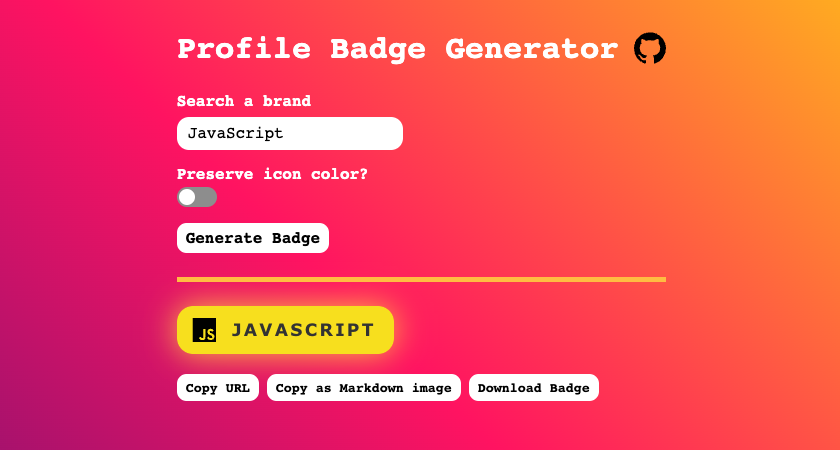

# Profile-Badge-Generator

The purpose of this project is to provide an easy way to create Badges like this one:

## Usage:

1. Go to https://profilebadges.vercel.app/
2. Enter the Logo you're trying to find
3. Press copy or download the Badge image.

## API:

URL: **https://profilebadges.vercel.app/api/%7Btitle%7D-%7BpreserveIcon%7D.json**

Preserve Icon [true/false]: If this option is enabled, the badge will have a white/black background and the icon is in the brands color. Otherwise, the background will have the brands color and the icon will be white/black.

**true:** 

**false:** 
